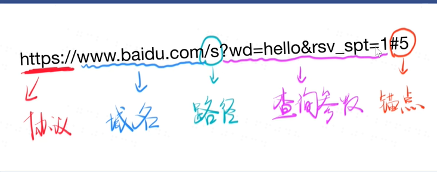

# url
1.URL包含哪几个部分，每部分分别有什么作用。



URL的组成有：协议、域名、路径、查询参数以及锚点。

## 协议
主要有HTTP协议和HTTPS协议，HTTP协议默认使用端口号80，HTTPS协议默认使用端口号是443。
## 域名
### IP
IP地址是用来定位互联网世界中的一台设备，每个上网的设备都有自己独立的IP地址。IP分为外网IP和内网IP。
### 特殊的IP地址
* 192.168.XXX.XXX表示内网地址。
* 127.0.0.1表示本机
     * 默认127.0.0.1的域名是localhost
     * 可以在hosts文件里更改本地127.0.0.1的域名。(要用管理员身份打开。)

## 端口
一台服务器可以提供很多服务，每个服务有不同的号码，这个号码就是端口。类似于，在麦当劳点餐，有咖啡窗口、快餐窗口、甜品站窗口，只能在咖啡窗口点咖啡、甜品站窗口点甜品。  
### 一台机器可以提供很多不同的服务
* 80端口：HTTP服务
* 443端口： HTTPS服务
* 21端口： FTP服务
### 端口的使用规则
1. 0-1023端口是系统用的，我们一般使用1024以后的端口
      *  比如http-server默认使用8080端口
      *  可以通过-p参数指定不同端口，例如：这样就可以指定使用1234端口


```
hs -c-1 -p 1234
```
2. 一共有65535个端口


## 路径
如何请求同一服务器上不同网页？
用路径即可
路径是没有必要有后缀的


[html](https://developer.mozilla.org/zh-CN/docs/Web/HTML)


[css](https://developer.mozilla.org/zh-CN/docs/Web/CSS)


## 查询参数
请求同一个页面，能得到不同内容吗？
用查询参数即可
```
http://www.baidu.com/s?wd=hi
http://www.baidu.com/s?wd=hello
```
## 锚点
同一内容，不同位置？
用锚点即可
```
https://developer.mozilla.org/zh-CN/docs/Web/CSS#教程
```
锚点不支持中文，会把中文进行编码
### 注意！
**锚点不会经过服务器，因为是本地内容
所以服务器不会阅读井号 # 之后的内容，不可以拿这个传参数！**

## 域名和IP怎么对应起来？DNS(域名系统) 基础结构的信
当你输入www.baidu.com
* chrome浏览器会向电信/联通提供的DNS服务器询问www.baidu.com对应什么IP
*  然后电信/联通会回复一个IP
*  然后chrome浏览器会向对应IP地址的80/ 443端口发送请求
*  服务器默认用80端口提供HTTP服务
*  服务器默认用443端口提供HTTPS服务
*  请求内容是查看www.baidu.com的首页


## 域名
域名是IP的别称
* 一个域名可以对应多个IP， 这叫负载均衡，防止一台机器无法同时为大量用户提供服务
* 不同地区ping taobao.com会看到不同的ip地址
* 一个IP也可以对应多个域名，这叫主机共享
## 关于域名的其他知识
www.baidu.com和baidu.com是不同的域名
1. .com是顶级域名
2. baidu.com是二级域名（俗称一级域名）
3. www.baidu.com 是三级域名（俗称二级域名）
4. 所以www.baidu.com是baidu.com的子域名
5. 例如，github.io是github的域名， userid.github.io是每个用户的域名
